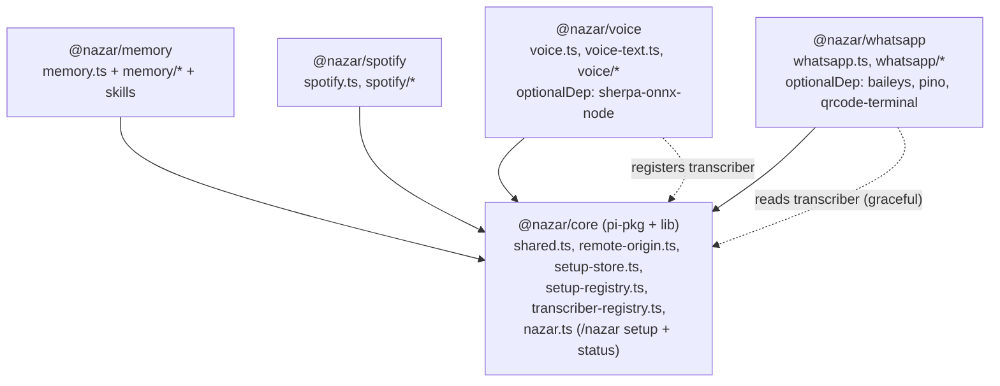

# Nazar Pareto Split Implementation Plan

## Overview

Apply the Pareto principle to the Nazar Pi extension product: remove dead/write-only code, collapse low-value configuration knobs, and split the three "satellite" features (Voice, Spotify, WhatsApp) out of the monolith into a 5-package npm-workspaces monorepo with a shared `@nazar/core`. No feature is dropped — satellites become independently installable Pi packages, so the core appliance becomes auditable and free of native/OAuth dependencies while every capability stays available.

This plan is the durable tracking pipeline across three sequential PRs. Cleanups (Phase A, B) ship first against the monolith so diffs stay small and the suite stays green; the split (Phase C) then moves already-clean code.

### Confirmed decisions (locked at approval)

1. **`memory_search` `query` mode** — dropped. Keep only `search`.
2. **QMD scopes** — collapsed to `default` (warm memory) + `archive` (cold). Drop `personal`/`ai`/`all`.
3. **`isJournalPrivateMessage` rollup filter** — removed along with the rest of the journal subsystem.
4. **Package granularity** — 5 packages: `@nazar/core`, `@nazar/memory`, `@nazar/voice`, `@nazar/spotify`, `@nazar/whatsapp`.
5. **Layout** — npm-workspaces monorepo.
6. **Coupling** — shared `@nazar/core`, keep all features (registry seams for setup + transcriber; `remote-origin` moves to core).

### Phase status tracker

| Phase | Scope | Status |
|---|---|---|
| A (Tier 0) | Dead / write-only code removal | completed (implemented and validated) |
| B (Tier 1) | Collapse low-value knobs | completed (implemented and validated) |
| C (Tier 2) | 5-package monorepo split | completed (implemented and validated) |

## Target architecture (after Phase C)



Each feature package registers its own setup provider and status text into core's registry at load time (same process-singleton pattern as today's `remote-origin.ts`). Core never imports a feature. WhatsApp gets STT through a core transcriber seam that Voice populates, so WhatsApp degrades gracefully if Voice is absent. Packages ship raw TypeScript (no build step), loaded via Pi's `jiti` — confirmed against `.pi/npm/node_modules/pi-subagents` (ships `src/**/*.ts`, `pi.extensions` points straight at `.ts`).

## Desired End State

- The monolith's dead code (journal subsystem, write-only runtime dirs, monthly leftovers) is gone with no behavior change.
- Memory paths derive from a single mental model: `PI_PROJECT_ROOT` + `NAZAR_HOME` (vault) + repo-local dev fallback. No `PI_MEMORY_*` override matrix, no advanced-paths setup branch.
- `memory_search` has one mode (`search`) and two scopes (`default`, `archive`).
- The repo is a private npm-workspaces root with `packages/{core,memory,voice,spotify,whatsapp}`, each a publishable Pi package.
- `@nazar/core` holds shared helpers, setup store/wizard shell, and the two registry seams; it imports no feature.
- `/nazar setup` and `/nazar status` are registry-driven and list whatever feature packages are installed.
- `npm test` (workspace-wide), `npm run pack:dry` per package, and `git diff --check` all pass.

## What We're NOT Doing

- No feature removal — satellites are split out, not deleted.
- No Pi RPC/SDK mode, no Pi core fork/patch, no MCP — Pi-extension surface only (per `AGENTS.md`).
- No build step — packages ship raw `.ts` loaded via `jiti`.
- No rewrite of memory rollup/pinned/QMD internals beyond the knob collapse.
- No deletion of legacy on-disk files (monthly rollups, old journal/sources/indexes/archive dirs) created by prior runs — only code paths are removed.
- No broad Baileys/Sherpa typing rewrite.

---

## Phase A — Tier 0: Dead / write-only code removal (PR1)

### Overview

Remove confirmed-unread/unwired code with zero feature loss. Completed by removing dead runtime path derivations, the journal helper/filter, raw/wiki-source scaffolding, monthly status output, stale memory-status lines, and matching tests/docs while keeping legacy on-disk files untouched.

### Changes Required

#### 1. Memory paths
**File**: `code/extensions/memory/paths.ts`
**Changes** (type fields already removed; finish derivations + returns):
- Remove derivations and return-object entries for `LLM_WIKI_RAW_DIR`, `JOURNAL_DIR`, `JOURNAL_ENTRIES_DIR`, `SOURCES_DIR`, `INDEXES_DIR`, `ARCHIVE_DIR` (runtime archive, distinct from the vault `04_Archive` that QMD reads).

#### 2. Memory core logic
**File**: `code/extensions/memory/memory-use.ts`
**Changes**:
- Remove `addJournalEntry`, `journalFileHeader`, and `isJournalPrivateMessage` (and its call sites in daily-bullet filtering / `compactMemory`).
- Remove `JOURNAL_DIR`/`JOURNAL_ENTRIES_DIR`/`SOURCES_DIR`/`INDEXES_DIR`/`ARCHIVE_DIR` from `ensureDirs()` `runtimeDirs`, the memoization `required` set, and from `memoryStatusText()` lines.
- Remove `LLM_WIKI_RAW_DIR` from the `ensureDirs()` vault-dir set and status.
- Drop `MONTHLY_DIR` from `rollupDirs()` and the legacy status line; simplify the two `compactMemory` result messages.

#### 3. Vault scaffold
**File**: `code/extensions/memory/vault.ts`
**Changes**:
- Stop creating `LLM_WIKI_RAW_DIR`; keep `LLM_WIKI_PAGES_DIR` (read/written by the wiki index/log).

#### 4. Tests
**File**: `code/tests/pi-memory.test.mjs`
**Changes**:
- Drop the `addJournalEntry` import and the journal helper/exclusion tests.
- Remove path assertions for journal/sources/indexes/archive/llm-wiki-raw.
- Keep/adjust the monthly-dir non-existence assertions.

### Success Criteria

#### Automated Verification
- [x] `node --test code/tests/pi-memory.test.mjs` passes.
- [x] `npm test` passes.
- [x] No remaining references: `journal`, `SOURCES_DIR`, `INDEXES_DIR`, `LLM_WIKI_RAW_DIR`, `MONTHLY_DIR` in `code/extensions/memory/**`.

#### Manual Verification
- [x] Existing on-disk legacy dirs/files are left untouched (no destructive cleanup added).
- [x] `memory status` no longer prints journal/sources/indexes/runtime-archive lines.

---

## Phase B — Tier 1: Collapse low-value knobs (PR2)

### Overview

Reduce the permanent branching tax in the memory path layer and QMD layer. Completed by deriving memory paths only from `PI_PROJECT_ROOT`, `NAZAR_HOME`/setup `vaultDir`, and repo-local fallback; persisting only `{ vaultDir }`; dropping `/memory query` and the `memory_search.mode` param; and collapsing QMD scopes to `default` + `archive`.

### Changes Required

#### 1. Memory path override matrix
**File**: `code/extensions/memory/paths.ts`
**Changes**:
- Keep only `PI_PROJECT_ROOT` and `NAZAR_HOME`. Remove `PI_MEMORY_ROOT`, `PI_MEMORY_PAGES_DIR`, `PI_AI_MEMORY_DIR`, `PI_HUMAN_MEMORY_DIR`, `PI_PERSONAL_MEMORY_DIR`.
- Remove the setup-config subpath matrix consumption (`rootDir`/`pagesDir`/`aiPagesDir`/`humanPagesDir`); always derive from the vault.
- Delete `envPath`'s configured-subpath argument, `configuredUnlessEnvVault`, and now-unused `configuredPath` plumbing.

#### 2. Setup store + wizard
**Files**: `code/extensions/nazar/setup-store.ts`, `code/extensions/nazar/setup-use.ts`
**Changes**:
- Reduce the persisted `memory` config to `{ vaultDir }`.
- In `configureMemory`, remove the `useDerived === false` "Advanced memory paths" branch and its four prompts; always write `memoryConfigFromVault(vaultDir)`.

#### 3. `memory_search` mode collapse
**Files**: `code/extensions/memory.ts`, `code/extensions/memory/memory-use.ts`
**Changes**:
- Drop the `mode` tool param and the `/memory query` subcommand; `searchMemoryText` uses a single QMD `search` mode.
- Update `details.command` and `/memory` help text.

#### 4. QMD scope collapse
**File**: `code/extensions/memory/memory-use.ts`
**Changes**:
- Reduce `MemorySearchScope` to `"default" | "archive"`.
- Simplify `memoryCollectionSpecs` per-collection `scopes` tagging: warm collections → `default`, the vault `04_Archive` → `archive`.
- Update `parseSearchCommandArgs` valid-scope set and the `memory_search` tool scope enum.

#### 5. Tests
**File**: `code/tests/pi-memory.test.mjs`
**Changes**:
- Remove `PI_MEMORY_*` env tests, the advanced-paths test, and the stale-env-key list entries.
- Update scope/query assertions to the collapsed surface.

### Success Criteria

#### Automated Verification
- [x] `node --test code/tests/pi-memory.test.mjs` passes.
- [x] `npm test` passes.
- [x] `memory_search` tool params expose only `query`, `limit`, `scope ∈ {default, archive}` (no `mode`).

#### Manual Verification
- [x] `/memory search` works; `/memory query` is no longer registered.
- [x] A `NAZAR_HOME` vault still resolves all derived paths; repo-local fallback still works with no env set.

---

## Phase C — Tier 2: 5-package monorepo split (PR3)

### Overview

Move already-clean code into `packages/{core,memory,voice,spotify,whatsapp}` under npm workspaces. Completed with registry-driven setup/status, a global transcriber seam for optional voice STT, global remote-origin attribution, package manifests/exports, moved tests, updated dev settings, package docs, and session-shutdown cleanup for global setup/transcriber registrations.

### Changes Required

#### C1. Scaffold workspace + `@nazar/core`
**Files**: `package.json` (root), `packages/core/package.json`, moved core files
**Changes**:
- Root `package.json` → private workspace root: `{ "private": true, "workspaces": ["packages/*"], scripts: { test, pack:dry } }`. Remove monolithic `pi.extensions`/`files`/`optionalDependencies`.
- Create `@nazar/core`: move `shared.ts`, `remote-origin.ts`, `nazar.ts`, `nazar/setup-use.ts`, `nazar/setup-store.ts` under `packages/core/code/extensions/...`. `pi.extensions: ["./code/extensions/nazar.ts"]`, light peerDeps only.
- Add `exports` map for raw `.ts`: `./shared`, `./setup`, `./remote-origin`, `./setup-registry`, `./transcriber`.

#### C2. Setup registry seam
**Files**: `packages/core/code/extensions/nazar/setup-registry.ts`, `nazar.ts`, each feature entry
**Changes**:
- Lift the existing `SetupProvider`/`SETUP_PROVIDERS` shape into a process-singleton registry: `registerSetupProvider({ id, label, order, configure, statusText? })` + `setupProviders()` (dedupe by id).
- Core builds the `/nazar setup` menu, section validator, and aggregated `/nazar status` from `setupProviders()` instead of static feature imports.
- Each feature package registers its own provider and moves its `configure*` logic out of core (memory → `@nazar/memory`, voice wizard + `setup-sherpa.mjs` + `sherpaModelStatus` → `@nazar/voice`, spotify → `@nazar/spotify`, whatsapp → `@nazar/whatsapp`).

#### C3. Transcriber seam + remote-origin
**Files**: `packages/core/.../transcriber-registry.ts`, voice + whatsapp + spotify entries
**Changes**:
- Add `setTranscriber(fn)` / `getTranscriber()` to core.
- `@nazar/voice` registers `transcribeSherpaPcm16` at load; `@nazar/whatsapp` calls `getTranscriber()?.(pcm)` and skips audio transcription when Voice is absent (documented optional/peer dep).
- Move `remote-origin.ts` to core; WhatsApp imports `set/clearRemoteTurnOrigin`, Spotify imports `getRemoteTurnOrigin` from `@nazar/core/remote-origin`.

#### C4. Move features into packages
**Files**: `packages/{memory,voice,spotify,whatsapp}/...`
**Changes**:
- Move each area's files under `packages/<x>/code/extensions/...` (intra-package relative imports unchanged).
- New `package.json` per package: `@nazar/<x>`, single `pi.extensions` entry, `pi.skills` where applicable (memory keeps `memory/skills`), `dependencies: { "@nazar/core": "workspace:*" }`, correct `optionalDependencies` (sherpa → voice; baileys/pino/qrcode-terminal → whatsapp), `files` glob.
- Rewrite cross-package imports: `../shared.ts` → `@nazar/core/shared`, `../nazar/setup-store.ts` → `@nazar/core/setup`, `../remote-origin.ts` → `@nazar/core/remote-origin`, whatsapp's `../voice/sherpa-runtime.ts` → `@nazar/core/transcriber`.

#### C5. Tests, dev settings, docs
**Files**: `packages/*/code/tests/*`, `.pi/settings.json`, `README.md`, `AGENTS.md`, `code/tests/README.md`
**Changes**:
- Move tests next to packages: `pi-spotify`/`pi-whatsapp`/`pi-voice` wholesale; `pi-memory` splits — truncation + `defaultVoiceModelDir` coupling → `@nazar/core`, command-shape + memory behavior → `@nazar/memory`. Update structural `package.json`/`.pi/settings.json` assertions.
- Update `.pi/settings.json` `extensions` to the new `packages/*/code/extensions/*.ts` paths.
- Update `README.md`, `AGENTS.md` (package layout + per-package install), and `code/tests/README.md`.

### Success Criteria

#### Automated Verification
- [x] Workspace install succeeds (`npm install` at root).
- [x] `npm test` (workspace-wide) passes.
- [x] `npm run pack:dry` passes for each package; each tarball contains only its own files + correct `optionalDependencies`.
- [x] `git diff --check` clean (CRLF/LF warnings expected on Windows).
- [x] `@nazar/core` source contains no import from `memory`/`voice`/`spotify`/`whatsapp`.

#### Manual Verification
- [x] Smoke-load via updated `.pi/settings.json`: extension entry modules import successfully; `/nazar setup` and `/nazar status` are registry-driven.
- [x] With `@nazar/voice` absent, WhatsApp audio messages skip transcription instead of erroring.
- [x] WhatsApp→Spotify playback attribution still works through core `remote-origin`.

---

## Testing Strategy

### Automated (per phase)

```sh
# Phase A & B (monolith)
node --test code/tests/pi-memory.test.mjs
npm test
npm run pack:dry
git diff --check

# Phase C (workspace)
npm install
npm test
npm run pack:dry --workspaces
git diff --check
```

### Manual smoke (after Phase C)

```sh
pi --no-session --offline -p "/nazar status"
pi --no-session --offline -p "/memory status"
pi --no-session --offline -p "/memory search test"
```

## Migration Notes

- No user data migration. Legacy on-disk dirs/files (monthly rollups, journal/sources/indexes/runtime-archive) are left untouched; only code paths are removed.
- Dropping `PI_MEMORY_*` env overrides is a behavior change for anyone relying on them; `NAZAR_HOME` + repo-local fallback remain. Document in `README.md`/`AGENTS.md`.
- After the split, consumers install per feature: `pi install npm:@nazar/core` + `npm:@nazar/memory` (+ optional `@nazar/voice`/`@nazar/spotify`/`@nazar/whatsapp`).

## Developer Context

- Coupling map (grounding the seams): `nazar/setup-use.ts` statically imports memory/voice/spotify/whatsapp; `whatsapp-use.ts` imports `transcribeSherpaPcm16` from `voice/sherpa-runtime.ts`; `spotify-use.ts` reads, `whatsapp-use.ts` writes `remote-origin.ts`.
- Build-free packaging confirmed against `.pi/npm/node_modules/pi-subagents` (ships raw `src/**/*.ts`, depends on `jiti`).
- The existing `SetupProvider`/`SETUP_PROVIDERS` array in `setup-use.ts` is nearly the registry seam already — C2 lifts it into core.
- Working-tree state at plan authoring: `code/extensions/memory/paths.ts` has the Phase A type-field deletions applied but derivations/returns not yet finished; complete Phase A before validating.

## References

- `.rpiv/artifacts/plans/2026-05-28_19-35-46_core-review-remediation.md`
- `.rpiv/artifacts/plans/2026-05-28_20-30-52_comprehensive-review-remediation.md`
- `.rpiv/artifacts/plans/2026-05-28_22-29-41_codebase-review-remediation.md`
- `AGENTS.md` — Product shape, Architecture patterns, KISS/YAGNI/SUCKLESS rules
